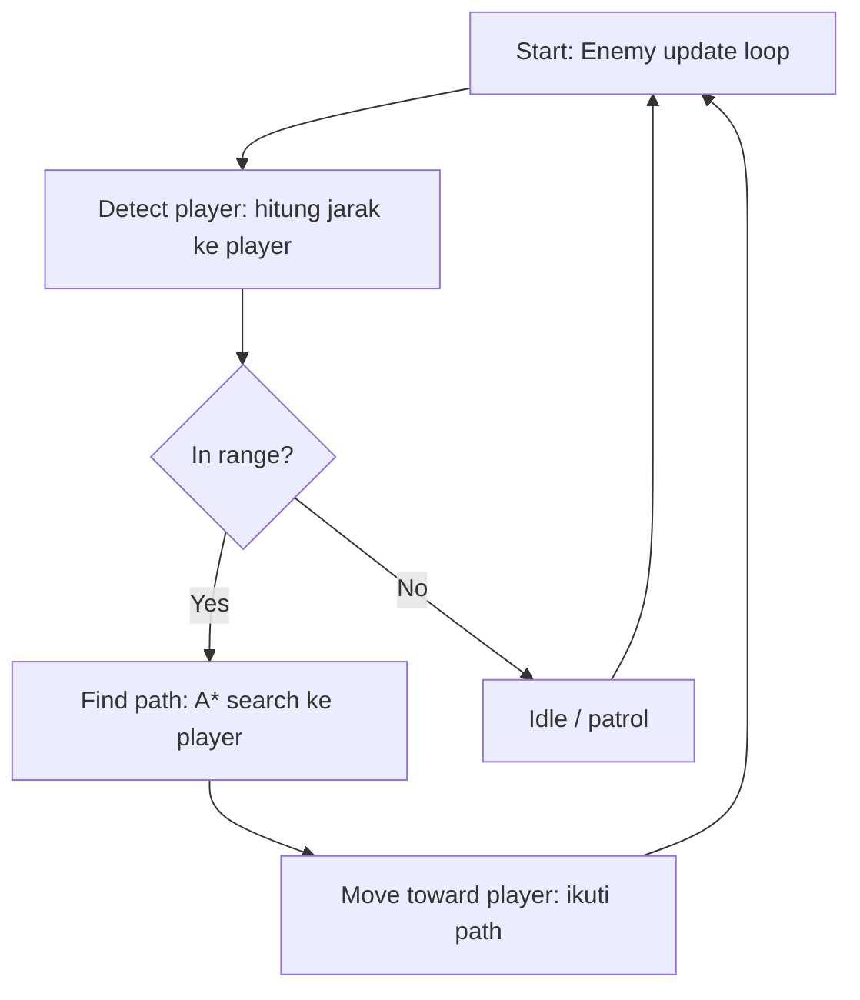

1. Identifikasi Algoritma yang Digunakan

Pada skenario ini, enemy dalam dungeon melakukan empat tahapan proses (deteksi, pengecekan jangkauan, pencarian jalur, dan pergerakan) yang masing-masing memerlukan pendekatan komputasi berbeda:

a. Deteksi Player - Euclidean Distance
Enemy perlu mengetahui posisi player relatif terhadap dirinya. Hal ini dilakukan dengan menghitung jarak antara dua titik (posisi enemy dan posisi player) menggunakan rumus jarak Euclidean:

$$d = \sqrt{(x_2 - x_1)^2 + (y_2 - y_1)^2}$$

b. Penentuan Jangkauan - Threshold/Range Checking
Nilai jarak yang diperoleh kemudian dibandingkan dengan radius deteksi (*detection radius*) milik enemy. Jika jarak ≤ radius deteksi, maka player dianggap berada dalam jangkauan dan enemy akan melanjutkan ke proses pencarian jalur. Jika tidak, enemy tetap dalam kondisi idle/patroli.

c. Pencarian Jalur - Algoritma A\* (A-Star)
Untuk menentukan jalur dari posisi enemy menuju posisi player di dalam dungeon (yang memiliki tembok/obstacle), digunakan algoritma A\* (A-Star) Pathfinding. Algoritma ini dipilih karena mampu mencari jalur terpendek secara efisien dengan mengombinasikan:
- Cost function g(n): biaya aktual dari titik awal ke titik n,
- Heuristic function h(n): estimasi biaya dari titik n menuju tujuan (biasanya menggunakan Manhattan atau Euclidean distance),
- Total cost f(n) = g(n) + h(n), yang digunakan untuk memilih node mana yang akan dieksplorasi berikutnya.

Dibandingkan algoritma pencarian jalur lain seperti BFS atau Dijkstra, A\* lebih efisien karena adanya fungsi heuristik yang mengarahkan pencarian langsung menuju target, sehingga mengurangi jumlah node yang perlu dieksplorasi.

d. Pergerakan Menuju Player - Path Following
Setelah jalur ditemukan oleh algoritma A\* (berupa kumpulan node/waypoint), enemy akan bergerak mengikuti jalur tersebut secara bertahap (node per node) pada setiap update/frame permainan hingga mencapai posisi player.

Kesimpulan:
Algoritma utama yang digunakan dalam sistem AI enemy ini adalah A\* (A-Star) Pathfinding Algorithm, yang dikombinasikan dengan perhitungan jarak Euclidean untuk deteksi serta logika perbandingan sederhana (*threshold checking*) untuk menentukan apakah player berada dalam jangkauan enemy.

2. Flowchart
 

 
**Penjelasan flowchart:**
 
1. **Start** — enemy memulai siklus pengecekan (dijalankan berulang tiap frame).
2. **Detect player** — enemy menghitung jarak ke player menggunakan Euclidean distance.
3. **In range?** — jarak dibandingkan dengan radius deteksi:
   - **Yes** → lanjut ke pencarian jalur.
   - **No** → enemy masuk mode idle/patroli, lalu kembali mengecek di frame berikutnya.
4. **Find path (A*)** — jika player dalam jangkauan, enemy mencari jalur terpendek menuju player dengan mempertimbangkan tembok/obstacle di dungeon.
5. **Move toward player** — enemy bergerak mengikuti jalur (waypoint) hasil A* selangkah demi selangkah.
6. Siklus kembali ke **Start** untuk frame berikutnya, baik dari jalur "Yes" maupun "No".
---
 
3. Code Snippet (Python)
 
```python
import heapq
import math
 
# --- 1. Deteksi & Range Check ---
def distance(a, b):
    return math.hypot(a[0] - b[0], a[1] - b[1])
 
def is_player_in_range(enemy_pos, player_pos, detection_radius):
    return distance(enemy_pos, player_pos) <= detection_radius
 
 
# --- 2. Pathfinding: A* ---
def heuristic(a, b):
    # Manhattan distance, cocok untuk grid 4-arah
    return abs(a[0] - b[0]) + abs(a[1] - b[1])
 
def get_neighbors(pos, grid):
    x, y = pos
    candidates = [(x+1, y), (x-1, y), (x, y+1), (x, y-1)]
    result = []
    for nx, ny in candidates:
        if 0 <= ny < len(grid) and 0 <= nx < len(grid[0]):
            if grid[ny][nx] == 0:  # 0 = walkable, 1 = wall/obstacle
                result.append((nx, ny))
    return result
 
def a_star(start, goal, grid):
    open_set = [(0, start)]
    came_from = {}
    g_score = {start: 0}
 
    while open_set:
        _, current = heapq.heappop(open_set)
 
        if current == goal:
            # Rekonstruksi path dari goal ke start
            path = [current]
            while current in came_from:
                current = came_from[current]
                path.append(current)
            path.reverse()
            return path
 
        for neighbor in get_neighbors(current, grid):
            tentative_g = g_score[current] + 1
            if tentative_g < g_score.get(neighbor, float('inf')):
                came_from[neighbor] = current
                g_score[neighbor] = tentative_g
                f_score = tentative_g + heuristic(neighbor, goal)
                heapq.heappush(open_set, (f_score, neighbor))
 
    return None  # tidak ada jalur ke player
 
 
# --- 3. Pergerakan menuju player ---
class Enemy:
    def __init__(self, position, detection_radius=5, speed=1):
        self.position = position
        self.detection_radius = detection_radius
        self.speed = speed
        self.path = []
 
    def update(self, player_pos, grid):
        # Step 1: deteksi jangkauan
        if is_player_in_range(self.position, player_pos, self.detection_radius):
            # Step 2: cari jalur baru tiap frame (bisa dioptimasi: hanya jika player pindah grid)
            self.path = a_star(self.position, player_pos, grid)
        else:
            self.path = []  # idle / patrol
 
        # Step 3: bergerak sepanjang path
        if self.path and len(self.path) > 1:
            self.position = self.path[1]  # ambil langkah berikutnya
            print(f"Enemy moves to {self.position}")
        else:
            print("Enemy idle / no path to player")
 
 
# --- Contoh penggunaan ---
if __name__ == "__main__":
    dungeon_grid = [
        [0, 0, 0, 0, 0],
        [0, 1, 1, 1, 0],
        [0, 0, 0, 1, 0],
        [0, 1, 0, 0, 0],
        [0, 0, 0, 1, 0],
    ]
 
    enemy = Enemy(position=(0, 0), detection_radius=6)
    player_position = (4, 4)
 
    for frame in range(6):
        enemy.update(player_position, dungeon_grid)
```
